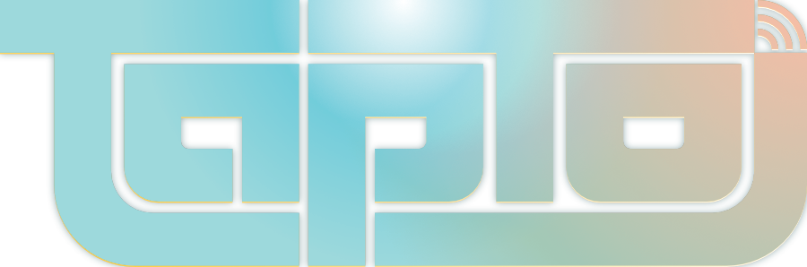

<h1 align="left">
  
</h1>

- [Downloads](https://github.com/wizzomafizzo/tapto/releases/latest/)
- [TapTo Wiki](https://tapto.wiki/)
- [Discord](https://wizzo.dev/discord)
- [Developer Guide](docs/developers.md)
- [API Documentation](docs/api.md)
- [Contributors](#contributors)
- [Licenses](#licenses)

---

TapTo is an open source system for launching games and scripted actions using physical objects like NFC cards. It's a great way to make playing games more accessible and add some fun to your gaming setup!

This is the development repository for the core TapTo software.

Want to get started with TapTo? Please visit the [TapTo Wiki](https://tapto.wiki/) for the latest information and guides. You can also [join the Discord](https://wizzo.dev/discord) if you need help.

## Contributors

TapTo has been a community effort from day one. Everyone's contributions are appreciated and encouraged! Want to contribute too? Check out the [Developer Guide](docs/developers.md).

- **Aitor Gómez García** &mdash; developer &mdash; [GitHub](https://github.com/spark2k06) | [Ko-Fi](https://ko-fi.com/spark2k06) | [Web](https://aitorgomez.net/) | [Twitter](https://twitter.com/spark2k06)
- **Andrea Bogazzi** &mdash; developer &mdash; [GitHub](https://github.com/asturur) | [Sponsor](https://github.com/sponsors/asturur) | [Twitter](https://twitter.com/AndreaBogazzi)
- **ArielAces** &mdash; label designer &mdash; [Store](https://www.artisticpixels305.com/) | [Twitter](https://twitter.com/ArielAces)
- **batty** &mdash; writer &mdash; [GitHub](https://github.com/protogem2) | [Twitter](https://twitter.com/goddamnbathead)
- **BedroomNinja** &mdash; case designer &mdash; [Printables](https://www.printables.com/@bedroom_ninj_1665215) | [Store](https://ko-fi.com/ninja3dp) | [Twitter](https://twitter.com/Bedroom_Ninja)
- **Gaz** &mdash; developer &mdash; [GitHub](https://github.com/symm) | [Twitter](https://twitter.com/gazj)
- **Ranny Snice** &mdash; logo creator &mdash; [GitHub](https://github.com/Ranny-Snice) | [Patreon](https://www.patreon.com/RannySnice704) | [Twitter](https://twitter.com/RannySnice)
- **RetroCastle** &mdash; PCB designer &mdash; [Store](https://www.aliexpress.com/store/912024455) | [Twitter](https://twitter.com/zhangch93067765)
- **Sensorium** &mdash; C64 developer &mdash; [GitHub](https://www.github.com/SensoriumEmbedded) | [TeensyROM](https://github.com/SensoriumEmbedded/TeensyROM) | [Store](https://www.tindie.com/products/travissmith/teensyrom-cartridge-for-c64128/) | [Twitter](https://twitter.com/SensoriumEmb)
- **TheTrain** &mdash; PCB designer &mdash; [GP2040-CE GitHub](https://github.com/OpenStickCommunity/GP2040-CE) | [Twitter](https://twitter.com/thetrain24)
- **theypsilon** &mdash; developer &mdash; [GitHub](https://www.github.com/theypsilon) | [Patreon](https://www.patreon.com/theypsilon) | [Twitter](https://twitter.com/josembarroso)
- **Tim Wilsie** &mdash; UX designer &mdash; [GitHub](https://github.com/timwilsie) | [Twitter](https://twitter.com/timwilsie)
- **wizzo** &mdash; developer &mdash; [GitHub](https://github.com/wizzomafizzo) | [Patreon](https://patreon.com/wizzo) | [Store](https://ko-fi.com/wizzo) | [Web](https://wizzo.dev) | [Twitter](https://twitter.com/wizzomafizzo)
- **Ziggurat** &mdash; developer &mdash; [Github](https://github.com/sigboe) | [Paypal](https://paypal.me/sigboe156)

Special thanks to **Gaz** for starting the project originally, and to **[javiwwweb](https://github.com/javiwwweb/MisTerRFID)** and **[Conner](https://github.com/ElRojo/MiSTerRFID)** for their existing MiSTerRFID projects.

## Licenses

This project's source code is licensed under the [GNU General Public License v3](/LICENSE).

This project's [assets](/assets) (e.g. image templates, 3D models, PCB designs) and [documentation](/docs) is licensed under the [Creative Commons Attribution-ShareAlike 4.0 International](/assets/LICENSE) license, unless explicitly noted otherwise.

The TapTo logo was designed by and is © Ranny Snice. The terms of use for the logo are as follows:

- The logo **MAY** be used on designs and artwork for tokens (e.g. label designs, printed stickers, pre-printed NFC cards), including those sold and held commercially, with the intent to show they're compatible with TapTo software and hardware.
- The logo **MAY** be used on open source community hardware.
- The logo **MAY** be used to link back to this repository or for similar promotional purposes of a strictly non-commercial nature (e.g. blog posts, social media, YouTube videos).
- The logo **MUST NOT** be used on or for the marketing of closed source or commercial hardware (e.g. case designs, PCBs), without express permission from the project.
- The logo **MUST NOT** be used for any other commercial products or purposes, without express permission from the project.
- The shape and overall design of the logo **MUST NOT** be modified or distorted. You **MAY** change the colors if required.

Please contact the project if you are unsure about any of these licensing arrangements, or have any licensing requests.
