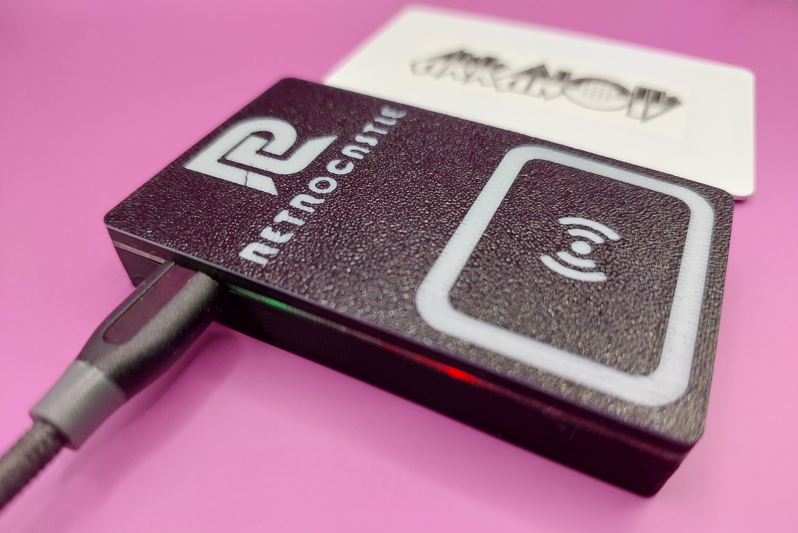
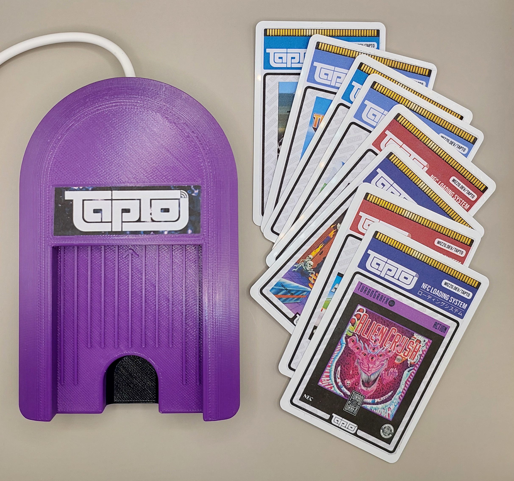
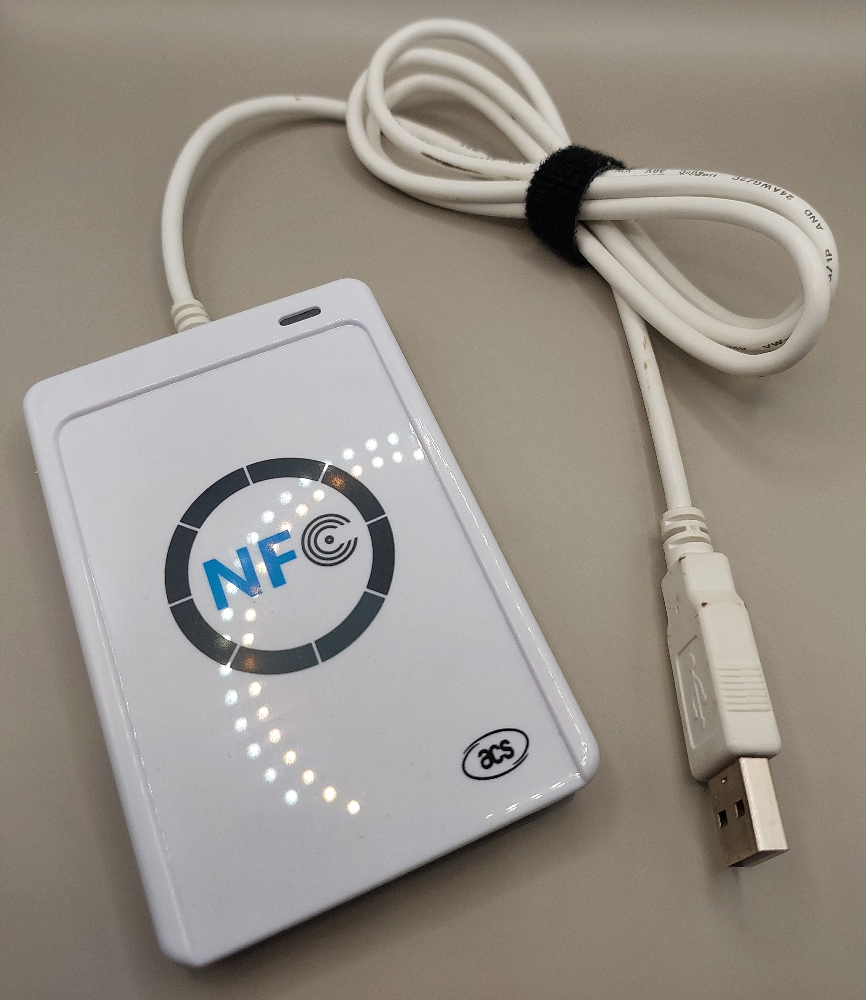
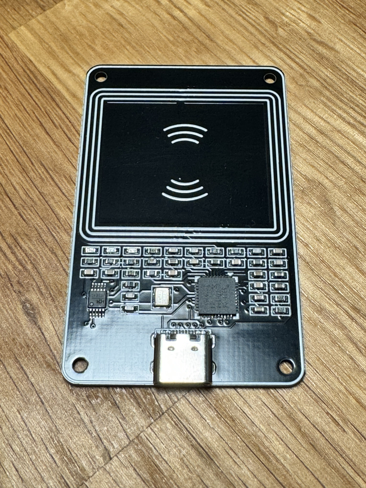
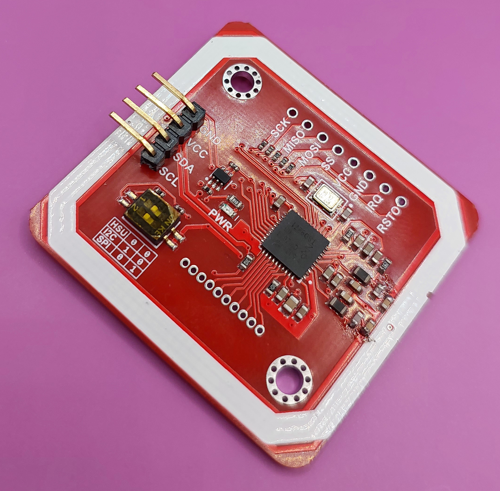

# Reader Hardware

These readers are currently confirmed to work with TapTo. Want to add a device or vendor? Please [open an issue](https://github.com/wizzomafizzo/tapto/issues/new).

TapTo uses the [libnfc](https://nfc-tools.github.io/projects/libnfc/) library, so there may be other devices that work with the correct configuration.

- [Reader Hardware](#reader-hardware)
  - [DIY NFC Reader](#diy-nfc-reader)
    - [Where To Buy](#where-to-buy)
    - [TapTo NFC-Engine](#tapto-nfc-engine)
  - [ACR122U](#acr122u)
    - [Known Issues](#known-issues)
    - [Where To Buy](#where-to-buy-1)
    - [TapTo NFC-Engine](#tapto-nfc-engine-1)
  - [PN532 NFC USB Module - Type C](#pn532-nfc-usb-module---type-c)
    - [Known Issues](#known-issues-1)
    - [Where To Buy](#where-to-buy-2)
  - [PN532 Module](#pn532-module)
    - [Known Issues](#known-issues-2)
    - [Where To Buy](#where-to-buy-3)

## DIY NFC Reader

The DIY NFC Reader is a TapTo community project aiming to offer a high quality and reliable reader at a low price, which is guaranteed to work with TapTo software.

- Can be built yourself with the [DIY NFC Reader Build Guide](diyreader.md)!
- Plug and play.
- Depending on vendor or batch size, comes at a very competitive price compared to ACR122U.
- Very small footprint with case.
- Used by other TapTo projects as a base.

Internally, this reader uses a [PN532 module](#pn532-module) and has all the same pros and cons associated with it. Having trusted vendors for this reader means none of the quality related issues with the module should be of concern.

### Where To Buy

- **[Grumpy Old Gamer](https://www.ebay.co.uk/usr/grumpyoldgamer)** &mdash; £24.99, UK based, ships worldwide &mdash; this is a great complete starter kit including USB cable, NFC cards, NFC stickers and rubber feet.
- **[wizzo](https://wizzo.dev/shop)** &mdash; $15-$19, Australia based, ships worldwide &mdash; basic reader plus cards bundle or build kits without a PN532 module

### TapTo NFC-Engine

The TapTo NFC-Engine is an alternative case for the DIY NFC Reader which fits around the outside. It's designed in the style of a PC-Engine HuCard loader where NFC cards are slotted into the top and stay for the duration of play. It has a set of HuCard inspired [label templates](labels.md) that match perfectly with the aesthetic!

The model is freely available to [print from Printables](https://www.printables.com/model/737533-tapto-nfc-engine) and is designed by [BedroomNinja](https://www.printables.com/@bedroom_ninj_1665215).

## ACR122U

- Plug and play.
- Reasonably priced from around $30 to $50 USD depending on vendor.
- Comes with a nice injection molded case and integrated USB cable.
- Has excellent short range reading but poor long range.
- The PCB is quite large which can make it difficult to use in custom projects.

### Known Issues

There is a version of the ACR122U reader which is not compatible with TapTo. It's not possible to tell from a shop listing, and we currently have no ETA on support.

Most listings are fine, but be aware of the risk. Your best bet is to not buy the literal cheapest listing available.

### Where To Buy

The ACR122U has been cloned for years and is readily available by searching for "ACR122U" on sites like Amazon, eBay and AliExpress.

These are some confirmed working listings submitted by users:

- [Amazon (US) - Yosoo Store](https://www.amazon.com/dp/B00GYPIZG6/?tag=theverge02-20)
- [Amazon (US) - ACS Store](https://www.amazon.com/dp/B07KRKPWYC)
- [Kogan (Australia)](https://www.kogan.com/au/buy/zoestore-kkmoon-nfc-acr122u-rfid-contactless-smart-reader-writerusb-sdk-c-card-d8a0-h10391/)
- [Everything ID (Australia)](https://www.everythingid.com.au/rfid-equipment-c-13/acr122u-usb-nfc-rfid-card-reader-writer-mifare-nfc-p-324)
- [AliExpress (China) - 5YOA Official Store](https://www.aliexpress.us/item/2251832554165448.html)

### TapTo NFC-Engine

The TapTo NFC-Engine is an alternative case for the ACR122U which fits around the internal PCB. It's designed in the style of a PC-Engine HuCard loader where NFC cards are slotted into the top and stay for the duration of play. It has a set of HuCard inspired [label templates](labels.md) that match perfectly with the aesthetic!

The model is freely available to [print from Printables](https://www.printables.com/model/737533-tapto-nfc-engine) and is designed by [BedroomNinja](https://www.printables.com/@bedroom_ninj_1665215).

## PN532 NFC USB Module - Type C

- Plug and play.
- Great price starting at around $8 USD.
- Has the same level of support as all other PN532 based readers.
- USB type C plug.
- Very small size.
- Does not come with a case, but fits in currently available community cases.

### Known Issues

This reader has not been thoroughly tested yet, but it shouldn't have any problems working with TapTo. Be cautious of quality from clone listings.

### Where To Buy

Can be bought directly [from Elechouse](https://www.elechouse.com/product/pn532-nfc-usb-module/).

Clones are also available on AliExpress by searching for "pn532 type c".

- [AliExpress (China) - Allinbest Store](https://www.aliexpress.us/item/1005006326438326.html)

## PN532 Module

:warning: The PN532 module is **not** a ready-to-use reader, it's a bare PCB module intended for custom projects. It can used directly with TapTo via a *USB to serial adapter*.

- Very cheap price, starting at around $3 USD.
- Small footprint and is great for custom projects.
- High quality modules have excellent short and long range reading (up to 5cm without interference).
- Plug and play when paired with a USB to serial adapter (UART).
- Has no case and will not function at all without additonal components.
- Build quality can be very variable depending on vendor, resulting in non-functioning modules or poor read range.
- Requires soldering equipment (but is a great beginner project).

### Known Issues

Build quality and shipping of these modules can vary a lot between vendors. In general they are ok, but be cautious about choosing the cheapest possible option.

Some modules may use low quality inductors connecting the antenna. This can result in a module that appears to function fine, but has extremely poor read range. It is possible to replace the inductors with new ones that are to spec.

Not necessarily related to the module, but some USB to serial adapters can have poor quality voltage regulators, which are not good enough to power the module properly.

### Where To Buy

Can be bought directly [from Elechouse](https://www.elechouse.com/product/pn532-nfc-rfid-module-v4/).

The PN532 module is extremely common in the hobby electronics space and very easy to find. You can search for "PN532 module" on sites such as Amazon, eBay and AliExpress, or check out your local hobby electronics shops and websites.

- [AliExpress (China) - JIAQISHENG JQS Official Store](https://www.aliexpress.com/item/1005002755983375.html)
- [AliExpress (China) - TENSTAR ROBOT Store](https://www.aliexpress.com/item/1005005973913526.html)
